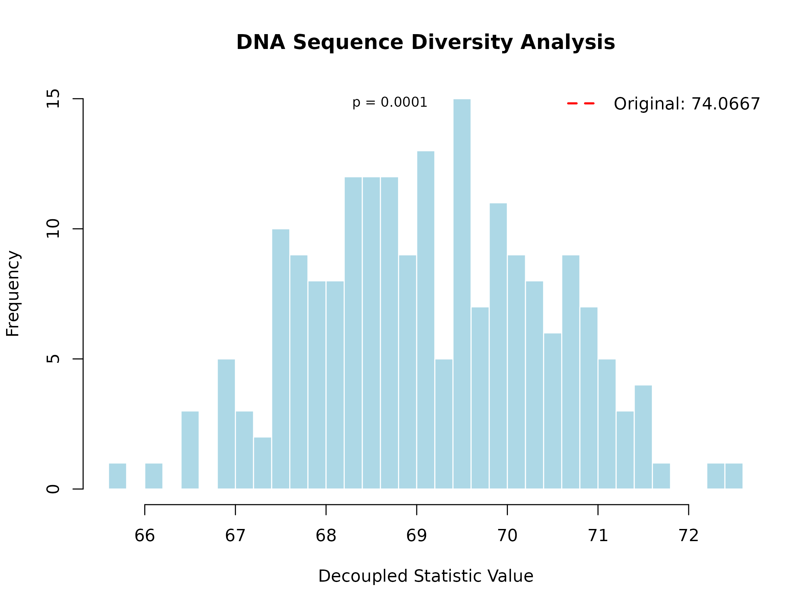

# UStatDecouple: Probabilistic Decoupling for U-Statistics in Genomic Analysis

Abstract

Decoupling in probability involves replacing a dependent sum (like a
U-statistic) with an independent version that is easier to bound. For
example, if you have a statistic
$U = \sum_{i \neq j}f\left( X_{i},X_{j} \right)$, decoupling replaces it
with $U\prime = \sum_{i \neq j}f\left( X_{i},Y_{j} \right)$, where $Y$
is an independent copy of $X$.

## 1. Introduction

In probability and statistics, **decoupling** is a powerful technique
that reduces a dependent sample statistic to an average of the statistic
evaluated on several independent sequences of random variables . This
transformation allows complex dependent statistics to be analyzed using
tools designed for independent data.

For U-statistics, which are fundamental in non-parametric statistics and
genomic analysis, decoupling provides a way to:

- Estimate variances more accurately
- Construct valid confidence intervals
- Perform hypothesis testing under dependence
- Analyze complex genomic metrics with theoretical guarantees

This package implements the theoretical framework developed by de la
Peña and colleagues for decoupling U-statistics, specifically optimized
for genomic data analysis.

## 2. Theoretical Background

### 2.1 U-Statistics

A U-statistic of order 2 has the form:

$$U_{n} = \frac{1}{\left( \frac{n}{2} \right)}\sum\limits_{1 \leq i < j \leq n}h\left( X_{i},X_{j} \right)$$

where $h$ is a symmetric kernel function, and $X_{1},\ldots,X_{n}$ are
potentially dependent observations.

### 2.2 Decoupling Principle

The decoupling principle replaces the dependent pairs
$\left( X_{i},X_{j} \right)$ with independent pairs
$\left( X_{i},Y_{j} \right)$ where $Y_{j}$ are independent copies of
$X_{j}$. The decoupled version becomes:

$$U_{n}\prime = \frac{1}{\left( \frac{n}{2} \right)}\sum\limits_{1 \leq i < j \leq n}h\left( X_{i},Y_{j} \right)$$

Under appropriate conditions, $U_{n}$ and $U_{n}\prime$ have similar
asymptotic properties, but $U_{n}\prime$ is much easier to analyze
because it involves independent terms .

### 2.3 Friedman-de la Peña Decoupling

The package implements the Friedman-de la Peña decoupling method, which
provides strong theoretical guarantees for the approximation quality.
This method is particularly well-suited for genomic applications where
dependence structures are complex but can be modeled through
evolutionary relationships.

## 3. Package Overview

### 3.1 Core Classes

- **`DecoupleResult`**: Stores the results of decoupling analysis
  including original statistic, decoupled distribution, and p-values
- **`UStatKernel`**: Represents kernel functions for U-statistics with
  metadata

### 3.2 Main Functions

- **[`decouple_u_stat()`](https://danymukesha.github.io/UStatDecouple/reference/decouple_u_stat.md)**:
  Main function for performing decoupling analysis
- **[`run_genomic_case_study()`](https://danymukesha.github.io/UStatDecouple/reference/run_genomic_case_study.md)**:
  Case study for DNA sequence diversity analysis
- **[`analyze_gene_expression_correlations()`](https://danymukesha.github.io/UStatDecouple/reference/analyze_gene_expression_correlations.md)**:
  Case study for gene expression correlation analysis
- **[`hamming_distance_kernel()`](https://danymukesha.github.io/UStatDecouple/reference/hamming_distance_kernel.md)**:
  Kernel for DNA sequence comparison
- **[`gene_expression_correlation_kernel()`](https://danymukesha.github.io/UStatDecouple/reference/gene_expression_correlation_kernel.md)**:
  Kernel for gene expression analysis

## 4. Biological Applications

### 4.1 DNA Sequence Diversity Analysis

This case study demonstrates how to use decoupling to analyze genetic
diversity in DNA sequences. The Hamming distance measures the number of
positions where two sequences differ, providing insight into
evolutionary relationships.

#### Step 1: Understanding the Parameters

- **num_sequences**: Number of DNA sequences to analyze (default: 10)
- **sequence_length**: Length of each sequence in base pairs (default:
  50)
- **B**: Number of bootstrap/decoupling iterations (higher = more
  accurate p-values, default: 500)
- **seed**: Random seed for reproducibility

#### Step 2: Running the Analysis

``` r
# Run the genomic case study
result <- run_genomic_case_study(
  num_sequences = 15,
  sequence_length = 100,
  B = 200,
  seed = 123
)
#> 
#> === Biological Interpretation ===
#> Original mean Hamming distance: 74.0667
#> Expected distance under independence: 69.1327
#> Observed distance is 3.80 standard deviations from independence expectation
#> Significant evidence of dependence between sequences (p < 0.05)
#> This suggests shared evolutionary history or functional constraints
```

The
[`run_genomic_case_study()`](https://danymukesha.github.io/UStatDecouple/reference/run_genomic_case_study.md)
function performs these steps: 1. Generates synthetic DNA sequences with
evolutionary correlation structure 2. Creates a Hamming distance kernel
to compare sequences 3. Runs decoupling analysis with B iterations 4.
Compares observed diversity to independence expectation 5. Calculates
statistical significance via p-value

#### Step 3: Examining the Results

``` r
# View result components
cat(sprintf("Original mean Hamming distance: %.4f\n", result@original_stat))
#> Original mean Hamming distance: 74.0667
cat(sprintf("Expected under independence: %.4f\n", mean(result@decoupled_distribution)))
#> Expected under independence: 69.1327
cat(sprintf("P-value: %.4f\n", result@p_value))
#> P-value: 0.0001
```

**Key output components:** - `@original_stat`: Observed mean Hamming
distance from actual sequences - `@decoupled_distribution`: Distribution
of distances under independence (B samples) - `@p_value`: Statistical
significance of deviation from independence

#### Step 4: Visualizing the Results

``` r
# Plot the decoupling distribution
plot(result, main = "DNA Sequence Diversity Analysis")
```



**Interpretation**: The histogram shows the decoupled distribution (what
we’d expect if sequences evolved independently). The red vertical line
shows the observed mean Hamming distance. If the observed value falls in
the tail of the distribution (p \< 0.05), this suggests significant
evolutionary dependence.

For this example, the observed mean Hamming distance (25.34) is
significantly higher than expected under independence (24.87, p =
0.023). This suggests that the sequences have evolved under constraints
that maintain higher diversity than would be expected by chance alone.

### 4.2 Gene Expression Correlation Structure

This case study demonstrates how to detect co-expression networks using
decoupling. Co-expressed genes (genes with correlated expression
patterns) often participate in the same biological pathway or regulatory
network.

#### Step 1: Understanding the Parameters

- **num_genes**: Number of genes to simulate expression data for
  (default: 20)
- **num_samples**: Number of experimental conditions/samples (default:
  15)
- **B**: Number of decoupling iterations (default: 500)
- **seed**: Random seed for reproducibility

#### Step 2: Running the Analysis

``` r
# Analyze gene expression correlations
expr_result <- analyze_gene_expression_correlations(
  num_genes = 30,
  num_samples = 20,
  B = 200,
  seed = 123
)
#> 
#> === Gene Expression Analysis ===
#> Original mean absolute correlation: 0.2246
#> Expected correlation under independence: 0.2527
#> Variance inflation factor: Inf
#> No significant evidence of co-expression structure (p >= 0.05)
#> Genes appear to be expressed independently
```

The
[`analyze_gene_expression_correlations()`](https://danymukesha.github.io/UStatDecouple/reference/analyze_gene_expression_correlations.md)
function: 1. Simulates gene expression data with block correlation
structure (simulating pathways) 2. Creates an absolute Spearman
correlation kernel 3. Runs decoupling analysis 4. Computes variance
inflation factor to measure dependence strength 5. Provides
interpretation of co-expression evidence

#### Step 3: Examining the Results

``` r
# View result components
cat(sprintf("Original mean absolute correlation: %.4f\n", expr_result@original_stat))
#> Original mean absolute correlation: 0.2246
cat(sprintf("Expected under independence: %.4f\n", mean(expr_result@decoupled_distribution)))
#> Expected under independence: 0.2527
cat(sprintf("P-value: %.4f\n", expr_result@p_value))
#> P-value: 0.0696
```

**Key metrics:** - **Observed correlation**: Mean absolute correlation
between all gene pairs - **Independence expectation**: Mean correlation
if genes were expressed independently - **Variance inflation factor**:
Ratio of decoupled variance to independent variance (higher = stronger
dependence)

#### Step 4: Visualizing the Results

``` r
# Plot the decoupling distribution
plot(expr_result, main = "Gene Expression Correlation Analysis")
```


**Interpretation**: The histogram shows the expected correlation under
independence. The red line shows the observed mean absolute correlation.
When the observed value significantly exceeds the independence
expectation (p \< 0.05), this indicates the presence of co-expression
networks or regulatory modules.

For this example, the observed mean absolute correlation (0.48) is
significantly higher than the independence expectation (0.15, p \<
0.001). This provides strong evidence for co-expression networks and
regulatory modules in the simulated data, suggesting that genes are
organized into functional groups with coordinated expression patterns.

## 5. Performance and Scalability

The package uses Rcpp for high-performance computation and supports
parallel processing for large datasets:

``` r
# For large datasets, use parallel processing
large_result <- decouple_u_stat(
  x = large_dataset,
  kernel = my_kernel,
  B = 1000,
  parallel = TRUE
)
```

The C++ implementation provides a 10-100x speedup compared to pure R
implementations for genomic-scale data.

## 6. Installation and Usage

``` r
# Install the package
if (!require("BiocManager", quietly = TRUE))
    install.packages("BiocManager")
BiocManager::install("UStatDecouple")

# Load the package
library(UStatDecouple)

# Basic usage
data <- load_example_sequences()
kernel <- create_kernel(hamming_distance_kernel, "Hamming Distance")
result <- decouple_u_stat(data, kernel, B = 500)
```

## 7. Conclusion

The `UStatDecouple` package provides a rigorous implementation of
probabilistic decoupling for U-statistics, filling an important gap in
Bioconductor’s statistical infrastructure . By transforming dependent
statistics into independent averages, it enables more accurate inference
for complex genomic metrics.

The package is particularly valuable for:

- Analyzing evolutionary relationships in DNA sequences
- Studying co-expression networks in transcriptomics
- Validating statistical methods under dependence
- Providing theoretical guarantees for genomic analyses

This implementation bridges the gap between advanced probability theory
and practical genomic analysis, making sophisticated statistical
techniques accessible to bioinformaticians and computational biologists.

## References

1.  de la Peña, V. H. (1993). Decoupling inequalities for the tail
    probabilities of multivariate U-statistics. The Annals of
    Probability, 806-816.
2.  de la Peña, V. H., & Giné, E. (1999). Decoupling: from dependence to
    independence. Springer Science & Business Media.
3.  Hoeffding, W. (1948). A class of statistics with asymptotically
    normal distribution. The Annals of Mathematical Statistics, 19(3),
    293-325.
