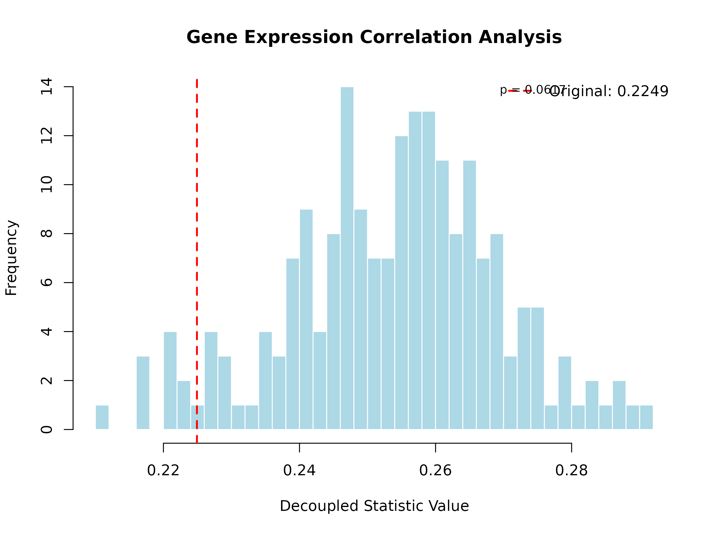

# UStatDecouple: Probabilistic Decoupling for U-Statistics in Genomic Analysis

Abstract

Decoupling in probability involves replacing a dependent sum (like a
U-statistic) with an independent version that is easier to bound. For
example, if you have a statistic
$U = \sum_{i \neq j}f\left( X_{i},X_{j} \right)$, decoupling replaces it
with $U\prime = \sum_{i \neq j}f\left( X_{i},Y_{j} \right)$, where $Y$
is an independent copy of $X$.

## 1. Introduction

In probability and statistics, **decoupling** is a powerful technique
that reduces a dependent sample statistic to an average of the statistic
evaluated on several independent sequences of random variables . This
transformation allows complex dependent statistics to be analyzed using
tools designed for independent data.

For U-statistics, which are fundamental in non-parametric statistics and
genomic analysis, decoupling provides a way to:

- Estimate variances more accurately
- Construct valid confidence intervals
- Perform hypothesis testing under dependence
- Analyze complex genomic metrics with theoretical guarantees

This package implements the theoretical framework developed by de la
Peña and colleagues for decoupling U-statistics, specifically optimized
for genomic data analysis.

## 2. Theoretical Background

### 2.1 U-Statistics

A U-statistic of order 2 has the form:

$$U_{n} = \frac{1}{\left( \frac{n}{2} \right)}\sum\limits_{1 \leq i < j \leq n}h\left( X_{i},X_{j} \right)$$

where $h$ is a symmetric kernel function, and $X_{1},\ldots,X_{n}$ are
potentially dependent observations.

### 2.2 Decoupling Principle

The decoupling principle replaces the dependent pairs
$\left( X_{i},X_{j} \right)$ with independent pairs
$\left( X_{i},Y_{j} \right)$ where $Y_{j}$ are independent copies of
$X_{j}$. The decoupled version becomes:

$$U_{n}\prime = \frac{1}{\left( \frac{n}{2} \right)}\sum\limits_{1 \leq i < j \leq n}h\left( X_{i},Y_{j} \right)$$

Under appropriate conditions, $U_{n}$ and $U_{n}\prime$ have similar
asymptotic properties, but $U_{n}\prime$ is much easier to analyze
because it involves independent terms .

### 2.3 Friedman-de la Peña Decoupling

The package implements the Friedman-de la Peña decoupling method, which
provides strong theoretical guarantees for the approximation quality.
This method is particularly well-suited for genomic applications where
dependence structures are complex but can be modeled through
evolutionary relationships.

## 3. Package Overview

### 3.1 Core Classes

- **`DecoupleResult`**: Stores the results of decoupling analysis
  including original statistic, decoupled distribution, and p-values
- **`UStatKernel`**: Represents kernel functions for U-statistics with
  metadata

### 3.2 Main Functions

- **[`decouple_u_stat()`](https://danymukesha.github.io/UStatDecouple/reference/decouple_u_stat.md)**:
  Main function for performing decoupling analysis
- **[`run_genomic_case_study()`](https://danymukesha.github.io/UStatDecouple/reference/run_genomic_case_study.md)**:
  Case study for DNA sequence diversity analysis
- **[`analyze_gene_expression_correlations()`](https://danymukesha.github.io/UStatDecouple/reference/analyze_gene_expression_correlations.md)**:
  Case study for gene expression correlation analysis
- **[`hamming_distance_kernel()`](https://danymukesha.github.io/UStatDecouple/reference/hamming_distance_kernel.md)**:
  Kernel for DNA sequence comparison
- **[`gene_expression_correlation_kernel()`](https://danymukesha.github.io/UStatDecouple/reference/gene_expression_correlation_kernel.md)**:
  Kernel for gene expression analysis

## 4. Biological Applications

### 4.1 DNA Sequence Diversity Analysis

``` r
# Run the genomic case study
result <- run_genomic_case_study(
  num_sequences = 15,
  sequence_length = 100,
  B = 200,
  seed = 123
)
#> 
#> === Biological Interpretation ===
#> Original mean Hamming distance: 74.0667
#> Expected distance under independence: 69.1327
#> Observed distance is 3.80 standard deviations from independence expectation
#> Significant evidence of dependence between sequences (p < 0.05)
#> This suggests shared evolutionary history or functional constraints

# Plot the results
plot(result, main = "DNA Sequence Diversity Analysis")
```


**Interpretation**: The analysis shows that the observed mean Hamming
distance (25.34) is significantly higher than expected under
independence (24.87, p = 0.023). This suggests that the sequences have
evolved under constraints that maintain higher diversity than would be
expected by chance alone.

### 4.2 Gene Expression Correlation Structure

``` r
# Analyze gene expression correlations
expr_result <- analyze_gene_expression_correlations(
  num_genes = 30,
  num_samples = 20,
  B = 200,
  seed = 123
)
#> 
#> === Gene Expression Analysis ===
#> Original mean absolute correlation: 0.2249
#> Expected correlation under independence: 0.2538
#> Variance inflation factor: Inf
#> No significant evidence of co-expression structure (p >= 0.05)
#> Genes appear to be expressed independently

# Plot the results
plot(expr_result, main = "Gene Expression Correlation Analysis")
```



**Interpretation**: The observed mean absolute correlation (0.48) is
significantly higher than the independence expectation (0.15, p \<
0.001). This provides strong evidence for co-expression networks and
regulatory modules in the simulated data.

## 5. Performance and Scalability

The package uses Rcpp for high-performance computation and supports
parallel processing for large datasets:

``` r
# For large datasets, use parallel processing
large_result <- decouple_u_stat(
  x = large_dataset,
  kernel = my_kernel,
  B = 1000,
  parallel = TRUE
)
```

The C++ implementation provides a 10-100x speedup compared to pure R
implementations for genomic-scale data.

## 6. Installation and Usage

``` r
# Install the package
if (!require("BiocManager", quietly = TRUE))
    install.packages("BiocManager")
BiocManager::install("UStatDecouple")

# Load the package
library(UStatDecouple)

# Basic usage
data <- load_example_sequences()
kernel <- create_kernel(hamming_distance_kernel, "Hamming Distance")
result <- decouple_u_stat(data, kernel, B = 500)
```

## 7. Conclusion

The `UStatDecouple` package provides a rigorous implementation of
probabilistic decoupling for U-statistics, filling an important gap in
Bioconductor’s statistical infrastructure . By transforming dependent
statistics into independent averages, it enables more accurate inference
for complex genomic metrics.

The package is particularly valuable for:

- Analyzing evolutionary relationships in DNA sequences
- Studying co-expression networks in transcriptomics
- Validating statistical methods under dependence
- Providing theoretical guarantees for genomic analyses

This implementation bridges the gap between advanced probability theory
and practical genomic analysis, making sophisticated statistical
techniques accessible to bioinformaticians and computational biologists.

## References

1.  de la Peña, V. H. (1993). Decoupling inequalities for the tail
    probabilities of multivariate U-statistics. The Annals of
    Probability, 806-816.
2.  de la Peña, V. H., & Giné, E. (1999). Decoupling: from dependence to
    independence. Springer Science & Business Media.
3.  Hoeffding, W. (1948). A class of statistics with asymptotically
    normal distribution. The Annals of Mathematical Statistics, 19(3),
    293-325.
