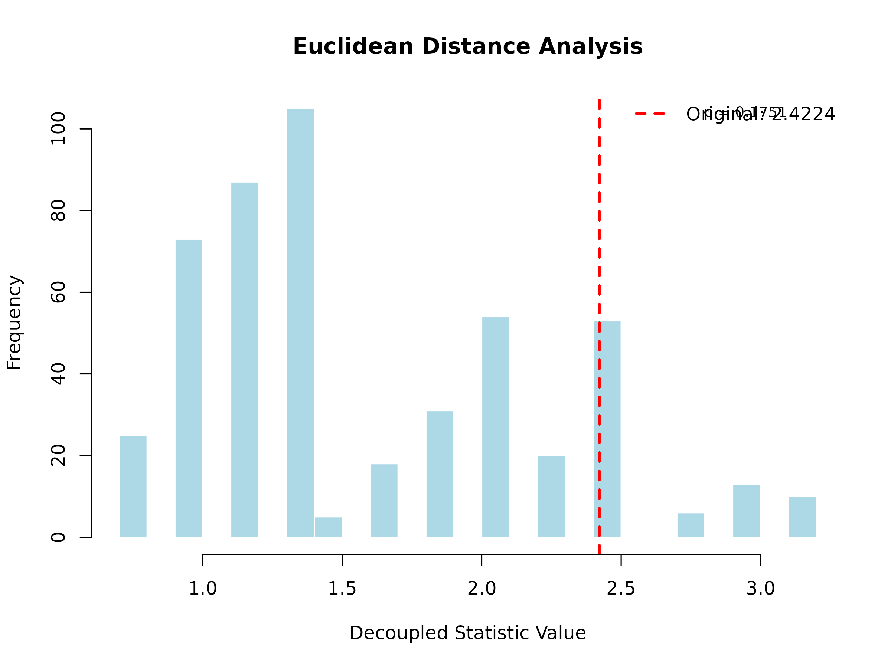
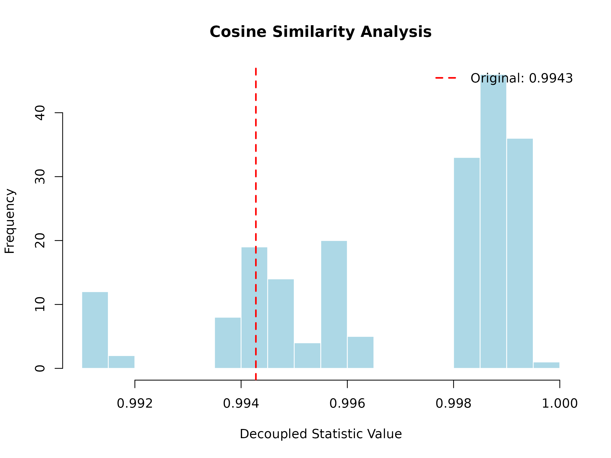
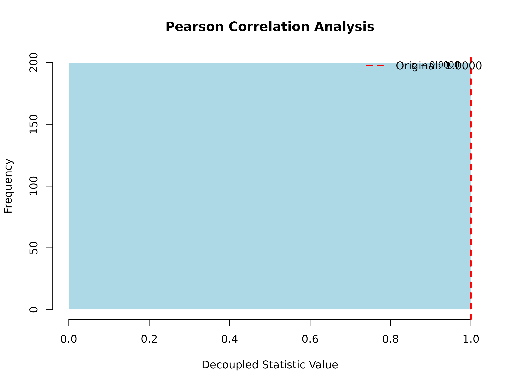

# Getting Started with UStatDecouple

Abstract

This vignette provides a gentle introduction to the UStatDecouple
package, covering the basic workflow, creating custom kernels, and
understanding the output.

## 1. Installation

``` r
# Install from Bioconductor
if (!require("BiocManager", quietly = TRUE))
    install.packages("BiocManager")
BiocManager::install("UStatDecouple")

# Or install the development version
if (!require("remotes", quietly = TRUE))
    install.packages("remotes")
remotes::install_github("dany-mukesha/UStatDecouple")
```

Load the package:

``` r
library(UStatDecouple)
```

## 2. Basic Workflow

The UStatDecouple package follows a simple 4-step workflow:

1.  **Prepare your data** as a list of observations
2.  **Create a kernel function** that measures similarity/distance
    between two observations
3.  **Run decoupling analysis** using
    [`decouple_u_stat()`](https://danymukesha.github.io/UStatDecouple/reference/decouple_u_stat.md)
4.  **Interpret the results** using the `DecoupleResult` object

### Step 1: Prepare Your Data

Your data should be structured as a **list**, where each element
represents one observation (e.g., a DNA sequence, gene expression
profile, or any other data type).

``` r
# Example: Numeric vectors
data_numeric <- list(
  sample1 = c(1, 3, 5, 7, 9),
  sample2 = c(2, 4, 6, 8, 10),
  sample3 = c(1.5, 3.5, 5.5, 7.5, 9.5),
  sample4 = c(0, 2, 4, 6, 8)
)

# Example: Character vectors (like DNA sequences)
data_dna <- list(
  seq1 = c("A", "C", "G", "T", "A"),
  seq2 = c("A", "C", "G", "T", "C"),
  seq3 = c("A", "C", "G", "A", "A"),
  seq4 = c("T", "C", "G", "T", "A")
)
```

### Step 2: Create a Kernel Function

A kernel function takes two observations and returns a single numeric
value representing their similarity or distance.

``` r
# Example: Euclidean distance kernel
euclidean_kernel <- function(x, y) {
  sqrt(sum((x - y)^2))
}

# Example: Absolute difference kernel
abs_diff_kernel <- function(x, y) {
  sum(abs(x - y))
}

# Example: Simple matching for sequences (1 if match, 0 if not)
simple_match_kernel <- function(seq1, seq2) {
  sum(seq1 == seq2)
}
```

### Step 3: Run Decoupling Analysis

Use
[`decouple_u_stat()`](https://danymukesha.github.io/UStatDecouple/reference/decouple_u_stat.md)
to perform the decoupling analysis:

``` r
# Create a kernel object with metadata
kernel <- create_kernel(euclidean_kernel, "Euclidean Distance")

# Run decoupling
set.seed(123)
result <- decouple_u_stat(
  x = data_numeric,
  kernel = kernel,
  B = 500,  # Number of decoupling iterations
  seed = 123
)
```

**Parameters:**

- `x`: Your data as a list
- `kernel`: A UStatKernel object (created with
  [`create_kernel()`](https://danymukesha.github.io/UStatDecouple/reference/create_kernel.md))
  or a plain function
- `B`: Number of decoupling iterations (higher = more accurate, default:
  1000)
- `parallel`: Use parallel processing (default: FALSE)
- `seed`: Random seed for reproducibility

### Step 4: Interpret the Results

The `DecoupleResult` object contains several components:

``` r
# Print the result
result
#> DecoupleResult object:
#>   Original U-statistic: 2.4224
#>   Decoupled mean: 1.5746
#>   Decoupled SD: 0.6252
#>   Kernel: Euclidean Distance
#>   Method: Friedman-de la Pena Decoupling
#>   P-value: 0.1751
#>   Z-score: 1.3561
#>   Significance:   (p = 0.1751)

# Access individual components
cat(sprintf("Original statistic: %.4f\n", result@original_stat))
#> Original statistic: 2.4224
cat(sprintf("Decoupled mean: %.4f\n", mean(result@decoupled_distribution)))
#> Decoupled mean: 1.5746
cat(sprintf("Decoupled SD: %.4f\n", sd(result@decoupled_distribution)))
#> Decoupled SD: 0.6252
cat(sprintf("P-value: %.4f\n", result@p_value))
#> P-value: 0.1751
cat(sprintf("Method: %s\n", result@method))
#> Method: Friedman-de la Pena Decoupling
```

**Understanding the output:**

- **@original_stat**: The average of the kernel function evaluated on
  all pairs in your original data
- **@decoupled_distribution**: A vector of B values representing what
  the statistic would be if your data points were independent
- **@p_value**: Probability of observing a statistic as extreme as yours
  under independence (two-tailed test)
- **@method**: The decoupling method used

A low p-value (\< 0.05) suggests that your data has dependence structure
beyond what would be expected by chance.

## 3. Visualizing Results

Use the built-in
[`plot()`](https://rdrr.io/r/graphics/plot.default.html) method to
visualize the decoupling distribution:

``` r
plot(result, main = "Euclidean Distance Analysis")
```



The histogram shows the decoupled distribution (what to expect under
independence), and the red vertical line shows the observed statistic.
If the observed value falls in the tails of the distribution, this
indicates significant dependence.

## 4. Creating Custom Kernels

You can create any custom kernel function. Here are some examples:

### Example 1: Cosine Similarity Kernel

``` r
cosine_similarity <- function(x, y) {
  dot_product <- sum(x * y)
  norm_x <- sqrt(sum(x^2))
  norm_y <- sqrt(sum(y^2))
  dot_product / (norm_x * norm_y)
}

# Use it
cosine_kernel <- create_kernel(cosine_similarity, "Cosine Similarity")
cosine_result <- decouple_u_stat(data_numeric, cosine_kernel, B = 200, seed = 123)
plot(cosine_result, main = "Cosine Similarity Analysis")
```



### Example 2: Pearson Correlation Kernel

``` r
pearson_correlation <- function(x, y) {
  cor(x, y, method = "pearson")
}

# Use it
pearson_kernel <- create_kernel(pearson_correlation, "Pearson Correlation")
pearson_result <- decouple_u_stat(data_numeric, pearson_kernel, B = 200, seed = 123)
plot(pearson_result, main = "Pearson Correlation Analysis")
```



### Example 3: Weighted Distance Kernel

``` r
# A distance kernel that weights the first half of the vector more heavily
weighted_distance <- function(x, y, weights = NULL) {
  if (is.null(weights)) {
    n <- length(x)
    weights <- c(rep(2, n/2), rep(1, n - n/2))  # First half double weight
  }
  sqrt(sum(weights * (x - y)^2))
}

# Use it
weighted_kernel <- create_kernel(weighted_distance, "Weighted Distance")
weighted_result <- decouple_u_stat(data_numeric, weighted_kernel, B = 200, seed = 123)
plot(weighted_result, main = "Weighted Distance Analysis")
```


### Example 4: Kernel with Multiple Arguments

If your kernel needs additional parameters, create a wrapper function:

``` r
# A kernel with a customizable parameter
custom_distance <- function(alpha = 1) {
  function(x, y) {
    (sum(abs(x - y)^alpha))^(1/alpha)
  }
}

# Create kernel with alpha = 2 (Euclidean-like)
euclidean_like <- create_kernel(custom_distance(alpha = 2), "Minkowski (α=2)")
result1 <- decouple_u_stat(data_numeric, euclidean_like, B = 200, seed = 123)

# Create kernel with alpha = 1 (Manhattan-like)
manhattan_like <- create_kernel(custom_distance(alpha = 1), "Minkowski (α=1)")
result2 <- decouple_u_stat(data_numeric, manhattan_like, B = 200, seed = 123)

# Compare
cat(sprintf("α=2 p-value: %.4f\n", result1@p_value))
#> α=2 p-value: 0.1995
cat(sprintf("α=1 p-value: %.4f\n", result2@p_value))
#> α=1 p-value: 0.1995
```

## 5. Understanding P-Values

The p-value is calculated using a two-tailed test based on the decoupled
distribution:

``` r
# The p-value calculation
null_mean <- mean(result@decoupled_distribution)
null_sd <- sd(result@decoupled_distribution)
z_score <- (result@original_stat - null_mean) / null_sd
p_value <- 2 * (1 - pnorm(abs(z_score)))

cat(sprintf("Z-score: %.4f\n", z_score))
#> Z-score: 1.3561
cat(sprintf("P-value: %.4f\n", p_value))
#> P-value: 0.1751
```

**Interpretation:**

- **p \< 0.05**: Strong evidence of dependence
- **p \< 0.01**: Very strong evidence of dependence
- **p \< 0.001**: Extremely strong evidence of dependence
- **p ≥ 0.05**: No significant evidence of dependence

## 6. Choosing the Right Kernel

The choice of kernel depends on your data and research question:

| Data Type       | Suggested Kernel                    | What it Measures                        |
|-----------------|-------------------------------------|-----------------------------------------|
| Numeric vectors | Euclidean distance, Correlation     | Geometric distance, linear relationship |
| Sequences       | Hamming distance                    | Number of differing positions           |
| Gene expression | Absolute correlation                | Co-expression strength                  |
| Categorical     | Jaccard index, Matching coefficient | Set similarity                          |
| Time series     | Dynamic Time Warping distance       | Temporal alignment                      |

## 7. Performance Tips

For larger datasets:

``` r
# Use parallel processing
large_result <- decouple_u_stat(
  x = large_data,
  kernel = my_kernel,
  B = 1000,
  parallel = TRUE  # Enables parallel computation
)

# Reduce B for faster (but less accurate) results
quick_result <- decouple_u_stat(
  x = data,
  kernel = my_kernel,
  B = 100  # Fewer iterations = faster
)
```

## 8. Common Errors and Solutions

### Error: “Sample size must be at least 2”

``` r
# Wrong: Single observation
bad_data <- list(x = c(1, 2, 3))
decouple_u_stat(bad_data, kernel)  # Error!

# Correct: Multiple observations
good_data <- list(
  x = c(1, 2, 3),
  y = c(4, 5, 6)
)
decouple_u_stat(good_data, kernel)  # Works!
```

### Error: “Kernel must be either a UStatKernel object or a function”

``` r
# Wrong: Passing a string
decouple_u_stat(data, "euclidean")  # Error!

# Correct: Create a kernel object
kernel <- create_kernel(euclidean_kernel, "Euclidean")
decouple_u_stat(data, kernel)  # Works!
```

### Error: “Sequences must be of equal length”

``` r
# Wrong: Different lengths
bad_data <- list(
  seq1 = c("A", "C", "G"),
  seq2 = c("A", "C", "G", "T")
)

# Correct: Same length
good_data <- list(
  seq1 = c("A", "C", "G"),
  seq2 = c("A", "C", "T")
)
```

## 9. Next Steps

Now that you understand the basics, you can:

1.  **Explore biological applications**: See the main vignette for
    genomic case studies
2.  **Try with your own data**: Apply the workflow to your research data
3.  **Experiment with custom kernels**: Design kernels specific to your
    domain
4.  **Compare multiple kernels**: Test different kernels to see which
    best captures your dependence structure

For more advanced topics and biological applications, see the main
`UStatDecouple` vignette.
